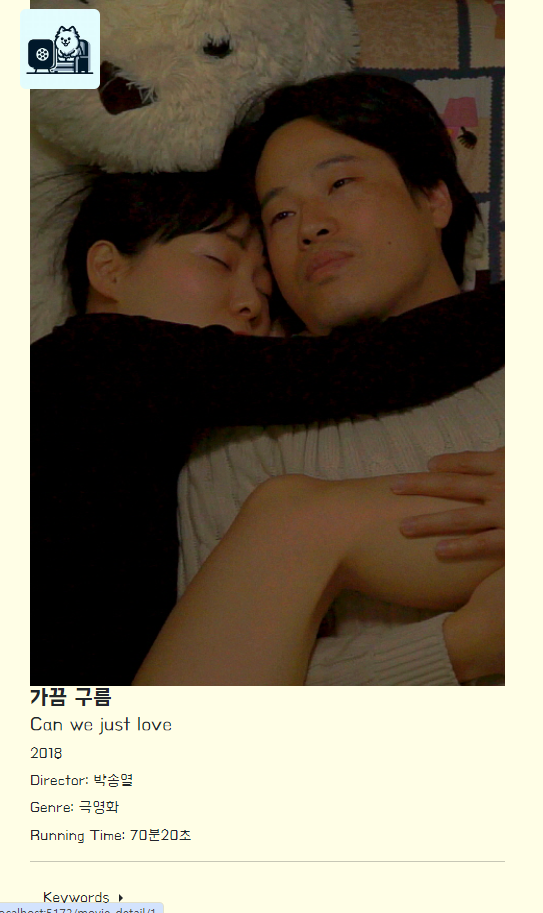

# 인디독 (INDEDOG)

독립영화 데이터베이스 / 커뮤니티

### 팀원 / 담당파트

1. 배원빈
    - Django 모델 생성
    - 커뮤니티 게시물, 댓글 CRUD
    - 데이터 크롤링
    - DRF RESTAPI / vue3 axios 연결
2. 한지웅
    - 챗 GPT AI API 디자인 및 생성
    - 카카오 맵 API 디자인 및 생성
    - 웹페이지 CSS 디자인
    - 데이터베이스 정렬 및 검색 기능 활성화
    - 페이지네이션 기능 활성화

## 일정
+ 5월 9일 - 주제 선정 및 주제 자료 검색 (독립영화)
+ 5월 13일 - 로그 선정 및 로그인 메뉴 제작
+ 5월 14일 - 영화 데이터 크롤링 착수, 회원가입 페이지 제작
+ 5월 15일 - 페이지네이션 도입, 영화 디테일 페이지 구현 시작
+ 5월 16일 - ERD 설계 및 구축, 상영관 맵 구축 시작
+ 5월 17일 - 네이버 맵 API 시도 -> 카카오 맵 API로 전환, 영화 검색페이지 제작
+ 5월 18일 - 로그인 업데이트, 커뮤니티 생성 및 맵 마커 업데이트
+ 5월 19일 - 게시글 수정 및 삭제 업데이트
+ 5월 20일 - 코멘트 생성 및 프론트 디자인 업데이트, 평점 시스템 구축 시작
+ 5월 21일 - 코멘트 수정, 삭제 작업 및 gpt 추천 시스템 구축 시작
+ 5월 22일 - 좋아요 및 유저페이지 생성, 페이지네이션 업데이트, AI 구축 완료
+ 5월 23일 - 코멘트 업데이트 및 상영관 평점 시스템 작업 완료. 구인 구직 페이지 생성
+ 5월 24일 - AI 결과값 추출 완료, 버튼, 로딩 등 버그 수정 및 유지보수


## 목표 서비스
1. 독립영화 데이터베이스 구축 및 최신화
2. 현재 상영중인 독립영화의 상영관 정보 불러오기
3. 불러온 데이터들을 바탕으로 커뮤니티 구축 및 활성화
4. 각 유저의 프로필 설정 - 아바타로 이미지 연결
5. 독립영화 구인구직 커뮤니티 구축
6. 챗 GPT를 통한 독립영화 정리 (후에 설문을 통한 독립영화 키워드 추천 서비스로 바뀜)
7. 모바일페이지 구현

## 실제 구현도
**메인페이지**


+ 초기구상도


유튜브 예고편, 뉴스 등을 제외하고, 키워드 추천, chat gpt AI 추천 서비스를 추가하여 메인페이지에 작성했다.

현재 상영중인 영화 포스터들을 애니메이션을 통해 가로로 계속 움직이게끔 
구현하였고, 좋아요를 기준으로 커뮤니티 게시판이 메인에 오도록 설정하였다.

**메뉴 네비게이션**


+ 좌상단 맨 위에 위치한 강아지 이미지를 클릭하면, 메뉴 네비게이션 바가 좌->우로 슬라이드되어 들어온다.
원래는 유저 네임 위에 아바타가 등록될 예정이었으나, 구현이 되지 못하여 유저 네임만 출력하기로 했다.

**로그아웃 시**


1. 인디 Db 사이트를 통해 독립영화 Db 구축 성공 / 작품 검색 활성화

+ 페이지네이션 구현 성공


2. 상영관 정보는 구글 지도 API / 인디서울(인디24) 데이터 크롤링(좌표) / 카카오 맵 API를 통하여 구현 성공

+ 상영관 링크를 누르면 디테일 페이지로 넘어가고, 평점과 코멘트를 남길 수 있음


- 링크를 완전 한국어로 만들지는 못해서 아쉬움


- 길찾기 링크를 누를 시, 카카오 맵으로 넘어가 도착지 정보로 입력됨

3. 각 독립영화의 포스터를 누를 시, 디테일 페이지로 가게됨


- 해당 영화의 제작년도, 러닝타임, 제목, 감독 등 정보를 불러오고, 평점 입력 및 수정 / 삭제 (평점은 수정되지 않음), 좋아요 입력, 키워드 검색, 평론 작성 등을 할 수 있도록 했다.

4. 이미지 업로드는 구현하지 못했으나, 유저페이지를 따로 만들어 작성한 게시글, 좋아하는 영화 등을 표시하도록 했다.


+ 좋아하는 작품들을 펼치게 되면, 모달이 뜨며 작품들의 정보를 불러오도록 했다.


5. 메뉴 창에 구인구직 컴포넌트를 둬서 독립영화 일자리에 지원하거나, 공고를 올릴 수 있도록 했다.


+ 유저는 공고 작성과 공고 지원을 할 수 있는데, 지원을 하게 되면 버튼이 변경되면서 디테일 페이지에 접속하면 지원 취소가 가능하게끔 했다.

+ 공고 작성자는 지원한 유저의 네임을 확인하여 현황을 확인하면서 그 유저의 유저페이지를 볼 수 있다.

원래는 이 유저 정보가 아바타와 연결이 되어, 메일정보, 직업 등을 입력하게끔 하려 했으나, 지금은 유저페이지에 연결하는 것으로 대체하였다.

6. 메인페이지에 애니메이션 되고있는 로봇을 클릭하면, chat gpt를 이용한 설문조사 서비스를 이용할 수 있다.


+ 설문 처음 부분에는 설문 과정을 소개하면서 선택지 답변 예시, 질문 예시 등을 알 수 있다.


+ 각 선택지를 하나만 선택할 수 있으며, 질문지는 옆으로 넘어가면서 출력된다. 답변 완료도를 밑에 %바로 표시하게 하여 현재 설문 진척도를 알 수 있고, 완료하게 되면 '완료하셨습니까?' 라는 밑의 문장을 클릭할 수 있다.

이를 통해 chat gpt에게 답변에 맞는 프롬프트를 제공하고, gpt의 응답을 통해 키워드를 얻어내어 인디고Db의 독립영화 Db를 그 키워드로 검색하게끔 설정하였다.

7. 메인페이지 모바일 페이지, 영화 검색창 부트스트랩 반응형 페이지 구현으로 일부는 구현할 수 있었지만, 프로젝트 중 기능 구현에 거의 시간을 투자하게 되어 모바일 페이지 구현은 추가 사항으로 남겨놓게 되었다. 

**일부 구현된 모바일페이지**





## ERD (데이터베이스 모델링)


- 모델
    - Avatar
    - User
    - Movie
    - Mozip
    - Article
    - Comment
    - Cinema

### 모델
1. Avatar
    -
    user의 추가적인 정보를 담기 위해 만든 모델이다.
    추후 이미지 업로드가 가능해지면 추가하고자 한다.

2. User
    -
    AbstractUser라는 django의 고유 모델이다. M:N으로 Article, Movie, Mozip과 연결되어 있다.
    - related_names = [ like_articles, like_movies, applicated]
    
    그리고 get_user_model로 is_staff 필드 정보를 조회할 수 있었는데, 이를 통해 관리자 여부를 파악할 수 있었다.

3. Article
    -
    게시판 이용을 위한 모델이다.
    
     movie와 user를 FK로 두고 있는데, 이는 각각 평론 대상(영화)와 작성자를 저장하기 위한 필드이다.

    movie는 상황에 따라, 반드시 저장할 필요는 없으므로 null=True를 설정하였다.

    like_users는 User와 M:N 필드를 둬서, 후에 좋아요 개수를 파악할 수 있도록 했다. is_notice는 공지사항일 경우에만 체크되도록 기본적으로는 false로 설정하였다.

4. Comment
    -
    댓글을 위한 모델이다.
    
    article을 FK로 두어, 특정 게시글과 1:N 관계를 만들고자 했다. like_users는 댓글 좋아요를 표현하고자 했지만, 구현은 하지 못했다.

    movie와 cinema 또한 FK인데, FK인 3개의 필드는 모두 특정 영화, 특정 상영관, 특정 게시글의 댓글을 위한 필드라고 보면 된다. 그래서 상황에 따라 이 필드에 반드시 값을 집어넣지 않아도 되므로, null=True로 설정하였다.

5. Mozip
    -
    구인공고 게시글을 위한 모델이다.

    job은 모집분야(직업), applicant는 참가자(들), 그리고 by는 모집마감기한을 뜻한다.

    참가자 applicant 필드와 M:N을 둬야 했던 이유는 참가자가 여러 공고에 지원을 할 수 있고, 하나의 공고에 지원자가 많을 수 있기 때문이다.

    by는 date필드로 두어 날짜가 저장되도록 설정했다.

6. Movie
    -
    영화 데이터를 위한 필드이다.

    크롤링을 통하여 얻은 영화 데이터에 각 필드 명으로 정보를 분류하여, 독립영화 Db를 구축할 수 있었다. 이를 통해 loaddata로 sqlite에 저장할 수 있었다.

    영화에도 좋아요를 할 수 있으면 좋을 거 같아서 like_users를 M:N으로 두었다.

7. Cinema
    -
    상영관 데이터를 위한 필드이다.

    이 또한 크롤링을 통해 얻은 상영관 데이터(좌표, 주소, 현재 상영중인 영화)의 정보를 필드로 분류하여 저장할 수 있었다. 이를 통해 카카오 맵 API를 구현했다.

    lat, long은 float필드로 설정한 이유는 좌표 자체가 소수이기 때문이다.

M:N인 like 라는 이름이 들어간 필드는 반드시 값이 리스트 안에 있어야 할 필요는 없으므로, blank를 True로 설정하였다.

## 영화 추천 알고리즘 - chat gpt와 키워드 검색을 통한

chat gpt의 API를 이용하여 gpt의 응답에 따른 영화 키워드 추천 서비스를 위해, 유저의 정보와 선호도 등을 수집하고자 간단한 설문을 만들었다.
 
1~4 까지의 유저가 답변할 수 있고, 그 답변을 리스트에 축적하게끔 했다.
다음은 슬라이드 배열 (질문과 각 답변을 저장할 수 있는 공간)이다.

``` js
const slides = [
  { id: 1, title: '나는', content: '청춘이라는 단어를 보면 가슴이 뛴다', select_list: four.value, target: '청춘'},
  { id: 2, title: '나는', content: '가족들과 함께 지내는 시간이 다른 것들 보다 소중하다', select_list: four.value, target: '가족'},
  { id: 3, title: '만약', content: '무서운 영화를 공짜로 볼 기회가 생긴다면', select_list: four.value, target: '공포'},
  { id: 4, title: '나는', content: '애니메이션을', select_list: four.value, target: 'animation'},
  { id: 5, title: '나는', content: '사랑의 힘을 굳게 믿는 사람이다.', select_list: four.value, target: '사랑'},
  { id: 6, title: '나는', content: '방황하는 청소년들을', select_list: four.value, target: '방황'},
  { id: 7, title: '만약', content: '나의 월급으로 노숙자 2명 평생의 끼니 및 거주 문제를 완벽하게 해결할 수 있다면 나는 기꺼이 월급을 지출할 것이다.', select_list: four.value, target: '취약층'},
  { id: 8, title: '나는', content: '과거의 역사에 관심이 있다.', select_list: four.value, target: '역사'},
  { id: 9, title: '나는', content: '지금 기분이', select_list: four.value, target: 'feel'},
]
```
4와 3은 극호, 호를 의미하며, 1은 극 불호를 뜻한다.

그리고 답변이 완료되면, 이 슬라이드를 순회하면서 각 답변마다 조건에 맞는 문자열을 inputData에 추가한다. 

```js
for (const slide of slides) {
    
    if (picked.value[slide.id] == 4) {
      if (slide.target == 'feel') {
        inputData.value += '난 지금 기분이 매우 좋아'
      } else {
        favorite.value.push(slide.target)
      }
    } else if (picked.value[slide.id] == 3) {
      if (slide.target == 'feel') {
        inputData.value += '난 지금 기분이 좋은 편이야'
      } else {
        like.value.push(slide.target)
      }
    } else if (picked.value[slide.id] == 1) {
      if (slide.target == 'feel') {
        inputData.value += '난 지금 최악의 기분이야'
      } else {
        hate.value.push(slide.target)
      }
    }
  }
```

그리고 favorite, like, hate에 내가 답변했던 질문의 키워드(역사면 역사, 기분이면 기분)들을 담아서, 이를 기준으로 임의로 만든 문자열을 추가한다.

이를 통해 추가된 문자열을 프롬프트로 gpt에 전송하고, 응답되는 값을 밑에 출력하게 된다.


유저는 이를 통해 각 키워드를 얻어, 웹페이지에 있는 검색기능에 키워드 검색을 하면 추천 키워드에 적합한 독립영화를 볼 수 있을 것이다.

## 핵심 기능

1. 크롤링을 통한 DB 구축


인디그라운드 에서는 seq값이 1부터 5576번까지, 등록순으로 나열되어 있었기에 그 규칙성을 통해 효율적인 크롤링을 시도할 수 있었다.

인디서울 사이트는 이미지 경로가 따로 존재하였기 때문에, 직접 찾아서 태그를 뽑아내어 유효한 사이트 문자열에 더하여 크롤링을 하였다.


M:N 필드와 관련하여 loaddata 시에는 그 중개모델의 필드에 데이터를 채워서 넣는 것이 아니라, 해당 모델을 참조하는 모델의 외래 필드에 외래키를 넣어서 로드해야 작동하는 것을 알게 되었다.

2. 키워드 추천 AI 시스템


과정 페이지


결과 페이지


최종 수정 후 결과 페이지


각 키워드를 검색 페이지에 연결하여 보낼 수 있도록 했다.

하지만 키워드가 데이터베이스 기준이 아닌 gpt 기준이므로, 검색 결과가 없을 수가 있다.

**코드**


그리고 응답 데이터에 #키워드 꼴로 추출되게 한 이유는 #을 기준으로 스플릿해서 그 배열을 순회하면서 키워드를 버튼으로 추출하고자 했기 때문이다.

사용된 기술은 마커찍기, 클릭하면 하단에 레이아웃 출력, 가는 길 알아보기 링크 클릭 시 길찾기로 바로 연결되는 기술이다.

3. 카카오맵 지도 API를 통한 상영관 조회 서비스와 여러 커뮤니티 구축

+ 카카오맵

인디 서울에서 크롤링한 상영관 주소 데이터를 바탕으로, 구글 API에서 좌표를 뽑아낸 다음, 그 좌표를 카카오 맵 API에 반영하여 카카오 맵에 상영관을 마커로 찍을 수 있도록 하였다.


상영관에 평점을 매길 수 있게 하였다. 핵심적으로는 평점을 매길 때마다 상영관 평점이 곧바로 업데이트 된다는 점이 의미가 있었다.


+ 커뮤니티 뷰 실행결과


각 컨테이너 안에 주제에 맞는 게시글이 배치되게끔 설정하였으며, 좋아요를 기준으로 정렬하여 게시글들을 출력한 컨테이너도 있다. 아쉬운 점은 비동기로 인하여 페이지를 한 두번 왔다 갔다 해야 좋아요 값이 업데이트 된다는 점이겠다.

- 디테일 뷰


- 구인공고 페이지


- 공고 모집자 입장에서의 페이지


지원 현황에서 몇명이 지원했는지, 그리고 누가 지원했는지를 표시할 수 있게 했다. 이를 통해 유저페이지에 접속하여 유저 정보를 확인할 수 있다. 비록 유저정보 디테일은 미구현 단계에 있으나 지원자가 누구인지 파악가능하게끔 했다는 것에 의의를 두었다.

- 지원자 입장에서의 페이지


등록했을 시 지원취소가 가능하도록 작성했다. 환경에 따라 버튼 디자인을 바꾸어 좀 더 어떤 상황인지를 파악할 수 있게끔 하였다.

- 유저 페이지


작성 게시글은 페이지네이션으로 넘길 수 있으며, 좋아하는 작품들은 캐러셀로 자동으로 옆으로 넘어간다. 펼쳐보기를 통해 모달을 띄울 수 있으며, 상세한 영화 정보를 확인할 수 있다.


## 마치며...

프론트엔드 담당 입장에서는 프론트엔드를 향한 거부감이 호감으로 바뀐 프로젝트라고 느꼈습니다.

백엔드 담당 입장에서는 django의 모델링이 설계했던 대로는 안되지만, 방법이 없지는 않아서 공부하는 보람이 있었습니다.

대체적으로 이번 프로젝트는 잠을 줄일 수 밖에 없었고, 개인적인 활동이 전보다 훨씬 제한되어 쉴 틈이 없었습니다. 그러나 프로젝트에 몰입해보니 아쉬운 점이 계속 보이고, 고치고 고치니까 더욱 빠져들게 되어 점점 완성되어 가는 웹사이트를 보니 보람을 조금이나마 느끼게 됐습니다. 비록 부족한 부분이 많았지만 그럼에도 끝까지 함께 해낼 수 있었다는 것에 기뻤습니다.

깃 협업 툴을 쓰는 것에 자신감이 붙었습니다. 어떻게든 복잡한 컨플릭트에서 벗어나기 위해 브랜치를 설정하고, 로컬에서 리모트 머지를 했던 것이 효과적이었다고 봅니다. 
vue3나 django가 실행이 안될 시, pip나 패키지체크 한 번 해보고 가는 것도 중요하다고 느꼈습니다.

앞으로도 웹 기술을 갈고 닦아서 또다른 프로젝트에도 끝까지 해낼 수 있도록 하고 싶습니다. 감사합니다.